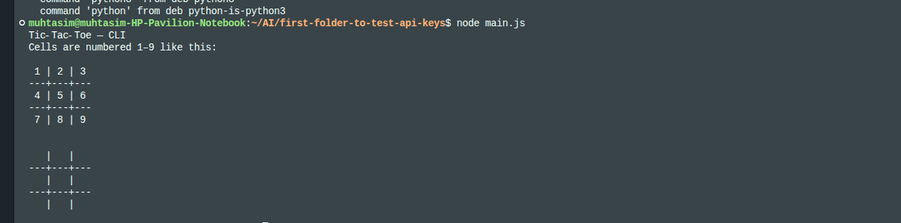
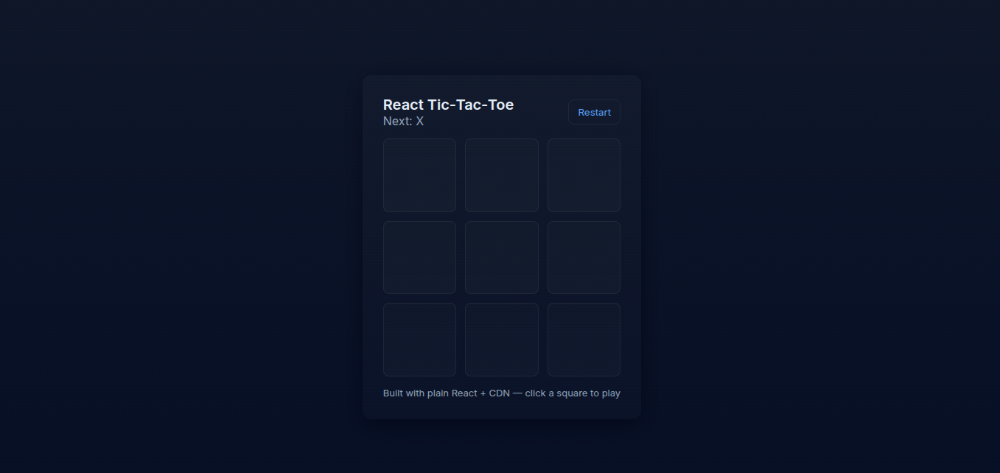
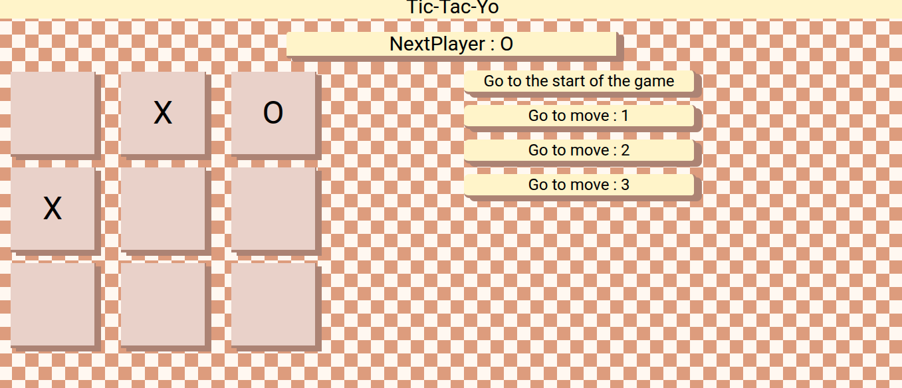

# After spending 360 minutes trying to complete this project

I used an AI tool to create the same thing. In this folder there are two subfolders: one containing the Node.js version of the tic-tac-toe game that runs in the terminal, and the other has a React version that was created by different AI models using OmniRoute's APIs.

Here are pictures of both games that AI made:

## However, I like my version better — guess no AI is gonna replace me soon

